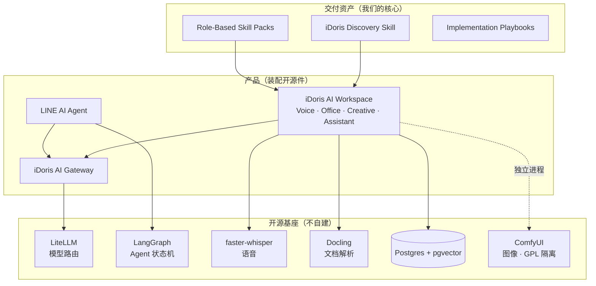
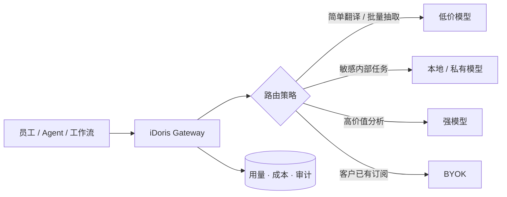
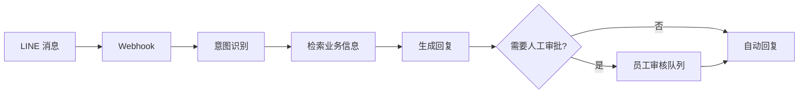

# iDoris Thailand 技术架构 — architecture

> 技术骨架、契约、不可破的边界。前置：[`research.md`](research.md)
> 记录日期：2026-09-05

## 零、一条总原则

**我们不造运行时，我们造方法论和装配。**

research.md 已经确认：Agent 运行时、模型网关、文档解析、向量检索、语音转写、
图像生成——**全都有成熟的 Apache/MIT 开源件**。自己造这些，是把有限的时间
花在别人已经做完的事上，而我们的差异化（Discovery 方法论、本地化、交付流程）
一分钟也没推进。

所以架构的核心问题不是「怎么实现」，是**「怎么装配，以及边界画在哪」**。

---

## 一、产品全景



---

## 二、还有哪些产品需要设计

这是 acceptance.md 第五节要的清单。按优先级排序，**理由写在后面**。

| # | 产品 | 状态 | 为什么是这个优先级 |
|:--|:---|:---|:---|
| 1 | **iDoris Discovery Skill** | 待设计 | 它是差异化本身。没有它，Discovery 就是不可复制的个人咨询 |
| 2 | **Discovery Sprint 样例** | 待做 | 销售弹药 + Skill 的需求来源。先做样例，再从样例抽象出 Skill |
| 3 | **AI Workspace (Starter Kit)** | 部分已有 | Voice 已有基础；是客户第一眼看到的东西 |
| 4 | **AI Gateway** | 待设计 | LiteLLM 直接可用，但**路由策略**是我们的 |
| 5 | **LINE AI Agent** | 待设计 | 泰国渠道特性极强 [待核：LINE 泰国用户约 5600 万]；旅游/服务业的 Quick Win |
| 6 | **Skill Pack 规格** | 待设计 | 让 Enablement 的产出是资产而不是 PPT |
| 7 | **Before/After 度量工具** | 待设计 | 所有交付的验收依赖它；也是案例库的数据来源 |
| 8 | Managed AI 运营面板 | 待设计 | ARR 的载体，但要有客户之后才有意义 |

**顺序的逻辑**：1→2 是先有方法再有样例？**不是，反过来**——
先用手做一个样例（2），从中抽象出 Skill（1）。
先抽象再实践，抽象出来的东西一定是错的。

---

## 三、各产品架构骨架

### 3.1 iDoris Discovery Skill

**它不是软件，是一个结构化的流程 + 一组模板 + 少量自动化。**

```
discovery-skill/
├── SKILL.md                 # 主流程：进场 → 访谈 → 分析 → 产出
├── interview/
│   ├── owner.md             # 对老板问什么
│   ├── manager.md           # 对中层问什么
│   └── user.md              # 对一线问什么
├── templates/
│   ├── workflow-map.md      # 泳道图模板
│   ├── readiness-score.md   # 五维评分表 + 判据
│   ├── pain-inventory.md    # 含年化工时算法
│   ├── impact-effort-risk.md
│   └── roadmap-90d.md
└── scripts/
    └── score.py             # 输入评分 → 输出矩阵与排序
```

**契约**：任何一个 FDE 按 SKILL.md 走完，产出的九项交付物**格式一致、可比较**。
不一致就是 Skill 的 bug，不是人的问题。

### 3.2 iDoris AI Gateway

**基座 LiteLLM（MIT），我们加的是路由策略与成本闸。**



**我们自建的部分**：
- **路由策略表**（任务类型 → 模型档位的映射，可按客户覆盖）
- **成本闸**（月度预算、超额告警、按部门配额）
- **审计留痕**（谁、什么时候、什么任务、用了哪个模型、花了多少）

**不自建**：模型 SDK 适配、重试、流式、token 计数——LiteLLM 全有。

**边界（写死）**：Gateway **绝不存储客户业务数据的内容**，只存元数据
（时间、用户、模型、token 数、成本）。内容留在客户侧或客户指定的存储。

### 3.3 iDoris AI Workspace（Starter Kit）

四个模块，共用 Gateway。

| 模块 | 开源基座 | 我们加的 |
|:---|:---|:---|
| **Voice** | faster-whisper | 泰语优化、三语混合输入、语音→文档模板 |
| **Office** | Docling + Gateway | 摘要/改写/对比/翻译/抽取的 Skill 化封装 |
| **Creative** | ComfyUI（**独立进程**） | 品牌一致性模板、社媒尺寸预设 |
| **Assistant** | LangGraph + Gateway | 会议→任务、邮件→草稿、LINE→建议回复 |

**GPL 隔离契约（不可破）**：Creative 通过 HTTP 调用独立部署的 ComfyUI，
**我们的代码库中不含任何 ComfyUI 代码，不与之链接**。
违反这条会让整个 iDoris Core 被 GPL 传染。

### 3.4 LINE AI Agent



**基座**：LINE Messaging API SDK（Apache 2.0）+ LangGraph（MIT，天然支持
human-in-the-loop 断点）。

**边界**：默认**所有对外回复都经人工审批**，自动回复是逐个用例显式开启的白名单。
理由：一条错误的自动回复对本地小生意的伤害，远大于省下的那点人工。

---

## 四、组织交付架构（三角色的接口契约）

技术架构之外，**交付流程本身也是架构**。它的契约在 [`spec.md`](spec.md)：

- 状态机：Lead → … → Operating → Expansion
- RACI：每个活动有且仅有一个 A
- 交接契约：BD→PM→Dev 各自交什么、回执什么

**与技术架构的接口**：Dev 的输入永远是 PM 交出的「工作流地图 + 用例 + 验收标准 +
数据边界」。**Dev 不直接从客户接需求**——那条路径一旦打开，范围就不可控了。

---

## 五、不可破的边界（汇总）

1. **GPL 组件只能独立进程调用**（ComfyUI）。
2. **n8n 不是开源许可**，不可作为托管服务核心卖点转售。
3. **客户数据/流程/业务逻辑不进开源仓库**，样例一律虚构。
4. **Gateway 不存内容，只存元数据。**
5. **LINE Agent 默认人工审批**，自动回复是白名单。
6. **Dev 不直接接客户需求**，必经 PM。
7. **BD 不单独承诺范围**，必经 PM 的可交付性回执。
8. **对外材料中的每个事实要么 [已核] 要么标 [待核]**，没有第三种。

---

## 六、技术选型的取舍记录

写下来是为了以后有人问「为什么不用 X」时不用重新吵一遍。

| 决策 | 选择 | 放弃的 | 理由 |
|:---|:---|:---|:---|
| Agent 编排 | LangGraph | Dify / n8n | Dify 太重且有品牌条款；n8n 许可不允许转售托管 |
| 模型网关 | LiteLLM | 自建 | 自建等于重写一遍别人做了两年的事 |
| 向量库 | pgvector | Qdrant / Milvus | 一个 Postgres 撑到几百万向量没问题，少一个要运维的东西 |
| 文档解析 | Docling | Unstructured | Docling 对表格与扫描件更好，MIT 更干净 |
| 语音 | faster-whisper | 云 API | 泰语数据敏感度高，本地跑是卖点不是成本 |
| 图像 | ComfyUI 独立服务 | 集成进主程序 | GPL 传染，只能隔离 |
| 前端 | 先不做 | Open WebUI | 前 3 个客户不需要自己的前端，Skill + 现有工具够用 |

**最后一条尤其重要**：**前三个客户不要做前端。**
做前端是最容易看起来很忙但不产生客户价值的事。
