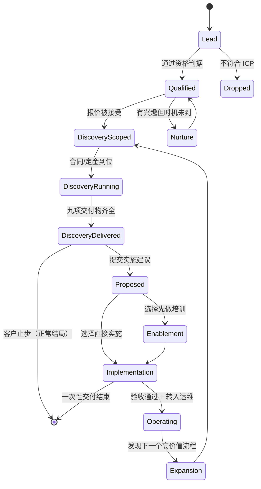

# iDoris Thailand 交付规格 — spec

> 精确到「照着能执行」。前置：[`research.md`](research.md) · [`acceptance.md`](acceptance.md)
> 记录日期：2026-09-05

本文件定义三件事：**客户旅程状态机**、**三角色 RACI**、**每阶段交付物规格**。
这三件加起来回答「一个新客户来了，全程谁做什么」。

---

## 一、三个角色是什么

| 角色 | 全称 | 一句话职责 | 失败时的样子 |
|:---|:---|:---|:---|
| **BD** | Business Development / Sales | 把机会带进来，并判断它值不值得做 | 什么单都接，交付端被拖死 |
| **PM** | Project Manager（泰语 native） | 把机会变成可交付的范围，并保证真的交付了 | 变成传话筒，两头都不担责 |
| **Dev** | Developer / FDE | 把范围变成能跑的东西，并保证它还能继续跑 | 做出很酷但没人用的东西 |

### 关键设计：PM 是泰语 native，不是 Dev

源文档的判断我认同并写死为规格：**第一个泰国本地员工不是程序员，是 PM。**

理由是可验证的：这门生意的瓶颈不在写代码（开源件已经很成熟，见 research.md），
在于**访谈能不能听懂、跟进能不能跟住、文档能不能让泰国客户看懂**。
技术核心由 Dev + 开源社区解决；本地化由 PM 解决。

反过来做的后果：变成「一个外国技术专家给泰国企业做项目」——不可复制，不可规模化。

### 关键设计：BD 有否决权，但没有承诺权

BD 可以拒绝一个机会（判断为不值得做），但**不能单独向客户承诺范围、工期、价格**。
承诺必须经过 PM 的范围确认。这条是防「销售卖了个交付不了的东西」的唯一机械保障。

---

## 二、客户旅程状态机

### 状态定义与门禁

每个状态的**进入条件**必须全部满足才能进入。缺一项就停在原地——
这不是官僚，是防止「先答应下来再说」。

| 状态 | 进入条件（全部满足） | 负责推进 | 典型时长 |
|:---|:---|:---|:---|
| **Lead** | 有联系人 + 有组织名 | BD | — |
| **Qualified** | ① 属于 ICP（教育 / 旅游服务 / 知识密集 SME）② 有具体重复性工作可指认 ③ 有人能拍板预算 ④ 愿意付费（哪怕便宜） | BD | 30–60 min 免费通话 |
| **Nurture** | 上面缺 ③ 或 ④，但 ①② 成立 | BD | 按月跟进 |
| **DiscoveryScoped** | 报价单已发出且被口头接受 + 范围与天数已确认 | BD → PM | 1–2 周 |
| **DiscoveryRunning** | 合同或定金到位 + 访谈日程已排 | **PM** | 3 或 5 个工作日 |
| **DiscoveryDelivered** | 九项交付物齐全（见下） + 已当面讲过 | PM + Dev | — |
| **Proposed** | 实施建议书已提交（范围/价格/工期） | BD + PM | — |
| **Enablement** | 角色与人数确认 + 场地/日程确认 | PM | 1–3 天 |
| **Implementation** | UAT 用例已双方确认 | **Dev** + PM | 按档次 |
| **Operating** | 验收签字 + 运维合同生效 + 管理员已培训 | PM | 按月 |
| **Expansion** | 运维中发现新的高价值流程 | BD + PM | — |

**Dropped 不是失败。** 明确记录「为什么不做」比留着一个永远不动的 Lead 有价值。

---

## 三、三角色 RACI

R=执行 · A=最终负责（每行有且仅有一个）· C=需被咨询 · I=需被告知

| 阶段活动 | BD | PM | Dev |
|:---|:---:|:---:|:---:|
| 线索获取与初筛 | **A/R** | I | — |
| 资格判定通话 | **A/R** | C | — |
| 报价与商务谈判 | **A/R** | C | I |
| 范围确认（写进报价单） | R | **A** | C |
| 合同与收款 | **A/R** | I | — |
| Discovery 访谈安排 | I | **A/R** | I |
| Discovery 访谈执行 | C | **A/R** | R |
| 工作流地图绘制 | — | **A/R** | C |
| AI Readiness 评分 | — | R | **A** |
| 用例识别与优先级排序 | C | R | **A** |
| 原型/演示制作 | — | C | **A/R** |
| 90 天路线图 | C | **A/R** | C |
| Discovery 交付会 | R | **A/R** | C |
| 实施建议书 | **A/R** | R | C |
| 培训方案设计 | — | **A** | R |
| 培训执行 | — | **A/R** | C |
| Skill Pack 制作 | — | C | **A/R** |
| 方案架构设计 | — | C | **A/R** |
| 实施开发 | — | I | **A/R** |
| UAT 用例编写 | — | **A/R** | C |
| UAT 执行与验收 | I | **A/R** | C |
| 用户手册与管理员手册 | — | **A** | R |
| 交接培训 | — | **A/R** | C |
| Before/After 度量 | C | **A/R** | C |
| 运维监控与月度优化 | I | **A** | R |
| 扩展机会识别 | **A** | R | I |

### 三条不可违反的规则

1. **每行只有一个 A。** 出现两个 A 的那一刻，就是没人负责的开始。
2. **BD 不做交付，Dev 不做承诺。** BD 在交付阶段最多是 C；Dev 在商务阶段最多是 C。
   这条防的是「销售现场答应了个做不到的」和「工程师私下改了范围」。
3. **PM 是唯一贯穿全程的 A。** 从 DiscoveryRunning 到 Operating，
   任何时刻问「这个客户现在谁负责」，答案都是 PM。

---

## 四、交接契约

阶段之间的交接是最容易掉东西的地方。这里规定**交什么、收到什么才算收到**。

### BD → PM（Qualified → DiscoveryScoped）

**BD 必须交出**：
- 组织基本情况（规模、行业、现有系统）
- 联系人图谱（谁拍板、谁使用、谁会反对）
- 客户自己说的痛点原话（**不是 BD 的转述**）
- 已承诺的范围与价格（书面）
- 已知的红线（不能碰的数据、不能改的流程）

**PM 收到后必须回执**：范围是否可交付。**不可交付就打回，不是硬着头皮接。**

### PM → Dev（DiscoveryRunning 内 / Implementation 前）

**PM 必须交出**：
- 工作流地图（现状，不是理想态）
- 明确的用例与验收标准（可观察、可度量）
- 数据边界与权限约束
- 谁是最终用户、他们的技术水平

**Dev 收到后必须回执**：技术可行性 + 工期估计 + 需要澄清的问题清单。
**有未澄清问题就不开工**，标 BLOCKED 回给 PM。

### Dev → PM（Implementation → Operating）

**Dev 必须交出**：
- 能跑的东西 + 部署方式
- 管理员手册（怎么改配置、怎么看日志、出问题找谁）
- 用户手册（最终用户视角，不含技术术语）
- 已知限制清单（**主动写出来，不等客户发现**）

---

## 五、每阶段交付物规格

### Discovery Sprint（3 天 / 5 天）

九项，**缺一项不算交付**：

| # | 交付物 | 规格要点 | 负责 |
|:--|:---|:---|:---|
| 1 | Current Workflow Map | 现状流程，含耗时与人数；用泳道图 | PM |
| 2 | AI Readiness Score | 五维评分：数据 / 流程标准化 / 工具基础 / 人员意愿 / 治理 | Dev |
| 3 | Pain Point Inventory | 每条含：谁、多久一次、单次耗时、年化工时 | PM |
| 4 | Top 3 AI Use Cases | 每个含：现状、AI 介入点、预期效果、所需组件 | Dev |
| 5 | Impact × Effort × Risk 矩阵 | 三轴各 1–5 分，给出排序与理由 | Dev |
| 6 | 可运行的小 Prototype | **必须能当场跑**，哪怕很粗糙 | Dev |
| 7 | Data / Privacy 风险 | 数据流向、驻留地、访问控制、模型选择建议 | Dev |
| 8 | 90-Day Roadmap | 分 30/60/90 三段，每段有可验收的产出 | PM |
| 9 | Implementation Proposal | 范围、档次、价格、工期、验收标准 | BD + PM |

**天数与价格的判据**（决定取 3 天还是 5 天）：
- 3 天：单一部门 / 流程清晰 / <50 人 / 无系统集成需求
- 5 天：跨部门 / 流程未标准化 / >50 人 / 需要接现有系统

### Enablement

- Role-Based Training Plan（按角色，不按工具）
- 组织自己的例子（**必须来自 Discovery 的发现，不用通用例子**）
- Prompt / Skill Playbook
- 工具与模型配置建议
- 数据处理守则
- 动手工作坊
- **可复用 Skill Pack**（交付物是资产，不是 PPT）
- 训后采纳检查表（2 周后回访用）

### Implementation 三档

| 档次 | 内容 | 交付物增量 | 典型工期 |
|:---|:---|:---|:---|
| **L1 Skill Pack** | 可复用 AI 能力包 | 配置好的 Skill + 文档 + 例子 | 1–2 周 |
| **L2 Agent / Workflow** | 接入一条可重复的业务流程 | + 方案架构、Agent 设计、集成规格、UAT 用例、运维手册 | 3–6 周 |
| **L3 Integrated System** | 接 CRM/ERP/数据库/内部知识 | + 权限设计、数据处理规则、管理员手册、交接培训 | 6 周+ |

**每一档都必须有 Before/After 度量**，见 acceptance.md 第三节。

### Managed AI（Operate）

月度服务，三档规模。包含：模型接入与路由、用量监控、成本控制、
Skill/Agent 更新、工作流维护、员工 onboarding、故障支持、月度优化、
备份与配置管理、治理支持。

---

## 六、单人退化路径（现在就是这个状态）

三个角色现在很可能是同一个人。**这不影响流程有效性，但必须知道哪些门不能合并。**

| 门 | 一个人时 | 能否合并 |
|:---|:---|:---:|
| BD 的资格判定 | 照做，写下来 | ✅ 可简化 |
| PM 对范围的可交付性回执 | **必须写下来**，哪怕自己写给自己 | ❌ **绝不合并** |
| Dev 的技术可行性回执 | **必须写下来** | ❌ **绝不合并** |
| 阶段门检查表 | 照做 | ❌ **绝不合并** |
| Before/After 度量 | 照做 | ❌ **绝不合并** |
| 各类手册 | 可以简化篇幅 | ✅ 可简化 |

**理由**：可以合并的是「沟通开销」；不可合并的是「判断」。
一个人身兼三职时，最容易出的错正是**跳过对自己的质疑**——
销售冲动直接变成开发承诺，中间那道「这真的交付得了吗」的门被省掉。
写下来是唯一的替代品。
