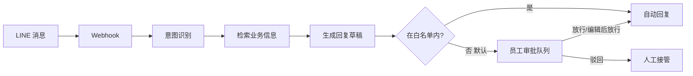

# LINE AI Agent 设计

> 泰国渠道特性最强的一个。**先出设计，不急实现。**
> 版本：v0.1 · 2026-09-05

## 0. 为什么值得单独做

[待核] 源文档称 LINE 官方数据泰国约 5600 万用户，LINE OA 是泰国企业的主要客户渠道。
**核法**：LINE 官方的泰国市场资料 / LINE Biz 泰国站。
**核之前不能做什么**：不得在对外材料（提案、一页纸、官网）里引用这个数字。

即使数字待核，方向判断是稳的：**Discovery 访谈里问「你们跟客户主要用什么沟通」
（`interview/manager.md` 第 11 题），泰国服务业的答案高频是 LINE。**
这是我们自己会验证到的事实，不依赖二手数据。

## 1. 它是什么

**它是 Assistant 第五条流程（LINE 客户询问 → 建议回复）的完整版**，
共用同一套 LangGraph 状态机与审批队列。区别只在**是否开放自动放行**。

所以：**Assistant 先做，LINE Agent 是它的延伸**，不是另起炉灶。

## 2. 开源基座

| 组件 | License | 负责 |
|:---|:---|:---|
| `line-bot-sdk-python` | **[已核]** Apache-2.0 | LINE 平台通道 |
| LangGraph | **[已核]** MIT | 状态机 + 人工审批断点 |
| iDoris Gateway | 自建 | 模型调用、路由、成本审计 |
| iDoris Documents | 本 Kit | 业务信息检索（`search` 动作） |

**[待核]** SDK 的许可 ≠ LINE 平台的服务条款。以商业身份代客户运营 LINE OA
需确认 LINE 开发者条款与商用规定。**这是渠道风险不是代码风险。**
**谁核**：BD/PM，立项前。

## 3. 默认全审，自动放行是白名单

这是本设计最重要的一条，理由写在 `../agent/architecture.md` 边界五：

> **一条错误的自动回复对本地小生意的伤害，远大于省下的那点人工。**

一家清迈酒店的 LINE 是他们的门面。回错一次房价、答错一次是否有空房，
损失的是真实订单和口碑。

**白名单的准入条件**（三条全满足才加一条意图）：
1. 客户**书面**确认
2. 该意图已积累 **≥50 条**人工审批历史，且准确率 ≥95%
3. 有随时一键关闭的开关

**默认白名单为空。**

## 4. 意图分类

第一版只识别五类，**其余一律转人工**：

| 意图 | 是否可能自动放行 | 为什么 |
|:---|:---:|:---|
| 营业时间 | 是（候选） | 事实性，几乎不会错 |
| 位置/交通 | 是（候选） | 同上 |
| 价目 | **否** | 价格会变，答错直接损失订单 |
| 预订/空房 | **否** | 涉及库存状态，必须查真实系统 |
| 投诉/异常 | **否** | 必须人接 |
| 其他 | **否** | 未知意图一律转人工 |

**「价目」明确不自动放行**，尽管它是最高频的问题之一。
这条是刻意的取舍：高频不等于低风险。

## 5. 最小可用形态

**半自动版：全部草稿 + 人工放行，零自动回复。**

即使这样也已经有价值：客服不用自己想措辞、不用查资料、不用翻译成英文——
**从 8 分钟降到 2 分钟**（源文档 Before/After 表里的一行）。

自动放行是第二阶段的事，且要等真实数据支撑。

## 6. 风险

| 风险 | 影响 | 对策 |
|:---|:---|:---|
| 自动回复答错 | 真实订单与口碑损失 | 默认全审；白名单三条准入 |
| 客户催着要全自动 | 事故风险 | 准入条件写进合同附件，不做口头承诺 |
| LINE 平台商用条款不符 | 渠道被封 | **[待核]** 立项前核 |
| 泰语敬语用错 | 显得不礼貌 | 与 Documents 的 `formality` 参数同一套处理 |
| 消息量突增 | 成本失控 | Gateway 成本闸按 tenant 生效 |
