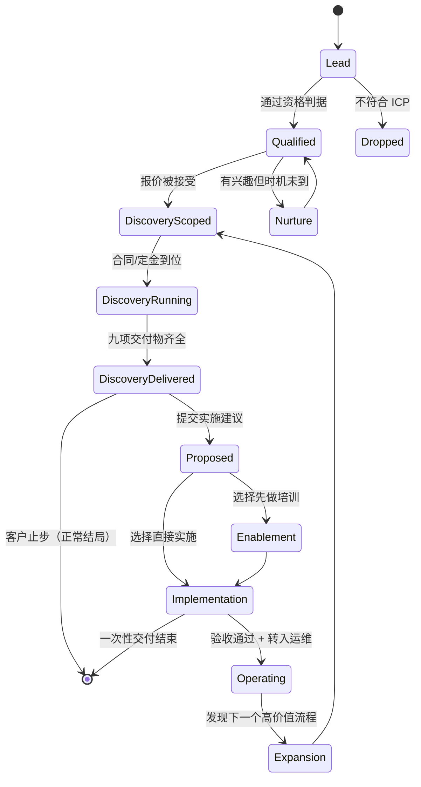

# 客户旅程手册

> 从 Lead 到 Managed AI，**每一步谁负责、产出什么、什么条件下能进下一步**。
> 这是给新人的操作手册。规格定义见 [`../agent/spec.md`](../agent/spec.md)。
> 版本：v0.1 · 2026-09-05

## 0. 三个角色，一句话

| 角色 | 一句话 | 失败时的样子 |
|:---|:---|:---|
| **BD** | 把机会带进来，并判断它值不值得做 | 什么单都接，交付端被拖死 |
| **PM**（泰语 native） | 把机会变成可交付的范围，并保证真的交付了 | 变成传话筒，两头都不担责 |
| **Dev** | 把范围变成能跑的东西，并保证它还能继续跑 | 做出很酷但没人用的东西 |

### 两条设计决定，值得记住理由

**PM 是泰语 native，不是 Dev。** 瓶颈不在写代码（开源件已经很成熟），
在于访谈能不能听懂、跟进能不能跟住、文档能不能让泰国客户看懂。
反过来做会退化成「一个外国技术专家给泰国企业做项目」——**不可复制，不可规模化**。

**BD 有否决权，但没有承诺权。** BD 可以拒绝一个机会，
但**不能单独向客户承诺范围、工期、价格**——必须过 PM 的可交付性回执。
这是防「销售卖了个交付不了的东西」的唯一机械保障。

---

## 1. 状态机

**`Dropped` 不是失败。** 明确记录「为什么不做」，比留着一个永远不动的 Lead 有价值。

**`DiscoveryDelivered → [*]` 也不是失败。** Discovery 做完客户说「我们自己试试」，
是一次成功的交付——他半年后回来的概率，远高于被硬推着买了不需要的东西的客户。

---

## 2. 每个状态怎么进、谁推进

| 状态 | 进入条件（**全部**满足） | 推进人 | 典型时长 |
|:---|:---|:---|:---|
| **Lead** | 有联系人 + 有组织名 | BD | — |
| **Qualified** | ① 属于 ICP ② 有具体重复性工作可指认 ③ 有人能拍板预算 ④ 愿意付费 | BD | 30–60 min |
| **Nurture** | 缺 ③ 或 ④，但 ①② 成立 | BD | 按月跟进 |
| **DiscoveryScoped** | 报价单已发出且口头接受 + 范围与天数确认 | BD → PM | 1–2 周 |
| **DiscoveryRunning** | 合同或定金到位 + 访谈日程已排 | **PM** | 3 或 5 天 |
| **DiscoveryDelivered** | 九项交付物齐全 + 已当面讲过 | PM + Dev | — |
| **Proposed** | 实施建议书已提交 | BD + PM | — |
| **Enablement** | 角色与人数确认 + 场地/日程确认 | PM | 1–3 天 |
| **Implementation** | **UAT 用例已双方确认** | **Dev** + PM | 按档次 |
| **Operating** | 验收签字 + 运维合同生效 + 管理员已培训 | PM | 按月 |
| **Expansion** | 运维中发现新的高价值流程 | BD + PM | — |

---

## 3. RACI

R=执行 · **A=最终负责（每行有且仅有一个）** · C=需被咨询 · I=需被告知

| 阶段活动 | BD | PM | Dev |
|:---|:---:|:---:|:---:|
| 线索获取与初筛 | **A/R** | I | — |
| 资格判定通话 | **A/R** | C | — |
| 报价与商务谈判 | **A/R** | C | I |
| 范围确认（写进报价单） | R | **A** | C |
| 合同与收款 | **A/R** | I | — |
| Discovery 访谈安排 | I | **A/R** | I |
| Discovery 访谈执行 | C | **A/R** | R |
| 工作流地图绘制 | — | **A/R** | C |
| AI Readiness 评分 | — | R | **A** |
| 用例识别与优先级排序 | C | R | **A** |
| 原型/演示制作 | — | C | **A/R** |
| 90 天路线图 | C | **A/R** | C |
| Discovery 交付会 | R | **A/R** | C |
| 实施建议书 | **A/R** | R | C |
| 培训方案设计 | — | **A** | R |
| 培训执行 | — | **A/R** | C |
| Skill Pack 制作 | — | C | **A/R** |
| 方案架构设计 | — | C | **A/R** |
| 实施开发 | — | I | **A/R** |
| UAT 用例编写 | — | **A/R** | C |
| UAT 执行与验收 | I | **A/R** | C |
| 用户手册与管理员手册 | — | **A** | R |
| 交接培训 | — | **A/R** | C |
| Before/After 度量 | C | **A/R** | C |
| 运维监控与月度优化 | I | **A** | R |
| 扩展机会识别 | **A** | R | I |

### 三条不可违反的规则

1. **每行只有一个 A。** 出现两个 A 的那一刻，就是没人负责的开始。
2. **BD 不做交付，Dev 不做承诺。** BD 在交付阶段最多是 C；Dev 在商务阶段最多是 C。
   这条防的是「销售现场答应了个做不到的」和「工程师私下改了范围」。
3. **PM 是唯一贯穿全程的 A。** 任何时刻问「这个客户现在谁负责」，答案都是 PM。

---

## 4. 三份交接契约

阶段之间是最容易掉东西的地方。这里规定**交什么、收到什么才算收到**。

### 4.1 BD → PM（Qualified → DiscoveryScoped）

**BD 必须交出**：
- 组织基本情况（规模、行业、现有系统）
- 联系人图谱（谁拍板、谁使用、**谁会反对**）
- **客户自己说的痛点原话**（不是 BD 的转述）
- 已承诺的范围与价格（书面）
- 已知红线（不能碰的数据、不能改的流程）

**PM 收到后必须回执**：范围是否可交付。**不可交付就打回，不是硬着头皮接。**

### 4.2 PM → Dev（DiscoveryRunning 内 / Implementation 前）

**PM 必须交出**：
- 工作流地图（**现状，不是理想态**）
- 明确的用例与验收标准（可观察、可度量）
- 数据边界与权限约束
- 谁是最终用户、他们的技术水平

**Dev 收到后必须回执**：技术可行性 + 工期估计 + **需要澄清的问题清单**。
**有未澄清问题就不开工**，标 BLOCKED 回给 PM。

### 4.3 Dev → PM（Implementation → Operating）

**Dev 必须交出**：
- 能跑的东西 + 部署方式
- 管理员手册（怎么改配置、怎么看日志、出问题找谁）
- 用户手册（最终用户视角，**不含技术术语**）
- **已知限制清单**（主动写出来，不等客户发现）

---

## 5. 单人退化路径（**现在就是这个状态**）

三个角色现在很可能是同一个人。这不影响流程有效性，
**但必须知道哪些门不能合并**。

| 门 | 一个人时 | 能否合并 |
|:---|:---|:---:|
| BD 的资格判定 | 照做，写下来 | ✅ 可简化 |
| **PM 对范围的可交付性回执** | **必须写下来**，哪怕自己写给自己 | ❌ **绝不合并** |
| **Dev 的技术可行性回执** | **必须写下来** | ❌ **绝不合并** |
| **阶段门检查表** | 照做 | ❌ **绝不合并** |
| **Before/After 度量** | 照做 | ❌ **绝不合并** |
| 各类手册 | 可简化篇幅 | ✅ 可简化 |

**理由**：可以合并的是**沟通开销**；不可合并的是**判断**。

一个人身兼三职时最容易出的错，正是**跳过对自己的质疑**——
销售冲动直接变成开发承诺，中间那道「这真的交付得了吗」的门被省掉。
**写下来是唯一的替代品。**

---

## 6. 一个新客户全程走一遍（清迈某精品酒店，示例）

| # | 谁 | 干什么 | 产出 | 进入下一步的条件 |
|:--|:---|:---|:---|:---|
| 1 | BD | 商会活动上认识老板 | Lead 记录 | 有联系人+组织名 |
| 2 | BD | 40 分钟通话，问四条资格判据 | 机会初判 | 四条全过 → Qualified |
| 3 | BD | 报 3 天 Discovery，35,000 THB | 报价单 | 口头接受 |
| 4 | **PM** | **回执：范围可交付** | 一句话确认 | ← **这道门不能省** |
| 5 | BD | 收定金，排日程 | 合同 | 定金到位 + 日程排定 |
| 6 | PM | 发进场前邮件，索取五样材料 | — | **拿到决策层受访承诺** |
| 7 | PM+Dev | Day 1–3 按 SOP 执行 | 九项交付物 | 九项齐全 |
| 8 | PM | 交付会 | — | 已当面讲过 |
| 9 | BD+PM | 实施建议书 | 提案 | 客户决定 |
| 10 | Dev | 实施 L1 Skill Pack | 可跑的东西 + 手册 | UAT 通过 |
| 11 | PM | Before/After 度量 | 度量报告 | 验收签字 |
| 12 | PM | 转 Managed AI | 运维合同 | — |

**第 4 步是整个流程里最容易被跳过、也最不能跳过的一步。**
