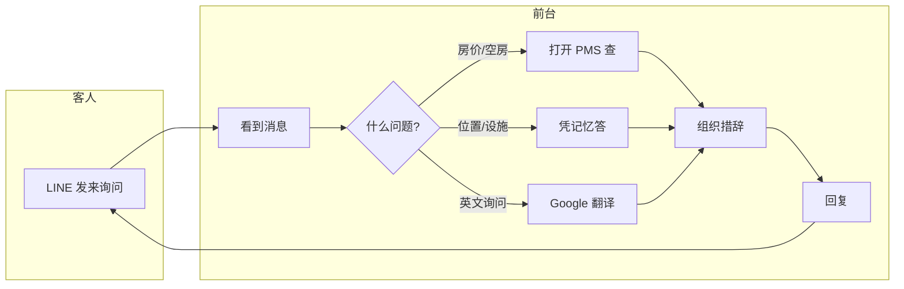
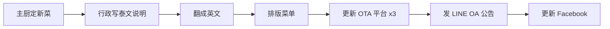

# 01 · 现状工作流地图

> 虚构样例。**图下必须跟耗时表——没有耗时的流程图是装饰品。**

## 流程 A · LINE 客户询问

| 步骤 | 谁做 | 耗时 | 用什么工具 | 是否重复 |
|:---|:---|---:|:---|:---:|
| 看到消息 | 前台 | 0.5 min | LINE OA | ✓ |
| 判断问题类型 | 前台 | 0.5 min | — | ✓ |
| 查 PMS | 前台 | 2.5 min | PMS 网页版 | ✓ |
| 翻译 | 前台 | 2.0 min | Google 翻译 | ✓ |
| 组织措辞 | 前台 | 2.0 min | — | ✓ |
| 回复 | 前台 | 0.7 min | LINE OA | ✓ |
| **合计** | | **8.2 min** | 3 个软件 · 4 步复制粘贴 | |

**观察**：**六步里五步是重复的**，且信息在 LINE / PMS / 翻译工具之间**靠人搬运**。

## 流程 B · 菜单换季

| 步骤 | 谁做 | 耗时 | 用什么工具 | 是否重复 |
|:---|:---|---:|:---|:---:|
| 写泰文说明 | 行政 | 3 h | Word | ✓ |
| 翻成英文 | 行政 | 4 h | Google 翻译 + 人工改 | ✓ |
| 排版菜单 | 行政 | 3 h | Canva | ✓ |
| 更新 OTA ×3 | 行政 | 3 h | 各平台后台 | ✓ |
| LINE OA 公告 | 行政 | 1 h | LINE OA | ✓ |
| Facebook | 行政 | 1 h | FB | ✓ |
| **合计** | | **15 h** | 6 个工具 | 一年 4 次 |

## 流程 C · 月度经营报告

| 步骤 | 谁做 | 耗时 | 用什么工具 | 是否重复 |
|:---|:---|---:|:---|:---:|
| PMS 导数据 | 行政 | 1 h | PMS 导出 CSV | ✓ |
| 手工做表 | 行政 | 4 h | Excel | ✓ |
| 写说明 | 行政 | 2 h | Word | ✓ |
| 老板复核修改 | 老板+行政 | 1 h | — | ✓ |
| **合计** | | **8 h** | 3 个工具 | 一年 12 次 |

## 我们没看到的部分

**客房部流程未观察**（老板认为他们不用电脑）。
→ 客房相关的任何结论**置信度低**，本次不提相关建议。
