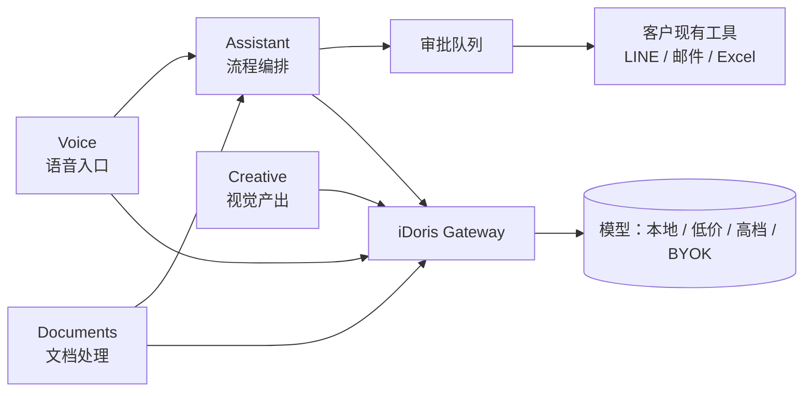

# Thailand AI Starter Kit v0.1 — 总体设计

> 四个组件的定位、边界与装配方式。各组件详设见同目录下的四份文档。
> 版本：v0.1 · 2026-09-05

## 1. 这个 Kit 解决的是什么

企业第一次看到 iDoris 时，不该看到 **Agent / LLM / RAG / MCP / Token**，
而该看到：

> **让你的员工明天开始每天少干 1–2 个小时重复工作。**

所以 Kit 的四个组件不是按技术分的，是按**员工每天在干的活**分的。

## 2. 四个组件

| 组件 | 一句话 | 状态 | 详设 |
|:---|:---|:---|:---|
| **Voice** | 说话变文字，泰英中混合 | **已有基础**，待盘点 | [`voice.md`](voice.md) |
| **Documents** | 六个动作：摘要/抽取/对比/翻译/改写/检索 | 待实现 | [`documents.md`](documents.md) |
| **Creative** | 社媒素材 + 泰英文案 | 待实现（**GPL 风险最高**） | [`creative.md`](creative.md) |
| **Assistant** | 五条流程，每条都有人工审批 | 待实现（**最复杂**） | [`assistant.md`](assistant.md) |

## 3. 它们怎么串起来



**Voice 和 Documents 是输入层，Assistant 是编排层，Creative 是独立的产出层。**
四者共用 Gateway——这是「省钱来自选对模型」这句承诺的技术兑现处。

## 4. 共用契约

### 4.1 所有组件都经 Gateway

没有任何组件直连模型 API。理由：

- **成本可见**：每次调用的模型与花费都进审计，客户能看到
- **可换模型**：客户想 BYOK、想用本地模型，改路由表即可，组件代码不动
- **成本闸**：月度预算、部门配额在一处生效

### 4.2 所有对外输出都带 `usage` 与出处

```jsonc
{ "result": ..., "citations": [...], "usage": {"model": "...", "tokens": ..., "cost_usd": ...} }
```

**没有出处的输出没人敢用；没有成本的输出没人敢放量。** 两个字段都是必填。

### 4.3 默认人工审批

Assistant 的所有流程默认要人点头。自动放行是**逐用例的白名单**，
需要客户书面确认 + ≥50 条历史数据。

理由见 `../../agent/architecture.md` 边界五。

## 5. 部署形态（第一批客户）

**我们托管，不给客户自部署。** 理由：

- 客户没有运维能力（Readiness 评分的「工具基础」维度普遍在 2–3 分）
- ComfyUI 要 GPU，自部署门槛太高
- 我们要能快速改——第一批客户本质上是在帮我们把产品跑通

**例外**：数据敏感度高的客户，Voice 可以单独部署在他们机器上
（这正是选本地 whisper 而非云 API 的原因）。

## 6. 实现顺序

| 序 | 做什么 | 为什么是它 |
|:--|:---|:---|
| 1 | **Voice 现状盘点** | 整个 Kit 的演示计划建立在它之上，不能在假设上叠设计 |
| 2 | **Assistant「会议→纪要→任务」** | 唯一能自己演示（不需客户数据）；一条跑通验证整个骨架 |
| 3 | **Documents `extract` + `translate`** | 演示效果最直接，技术风险最低 |
| 4 | **Creative `copy`（纯文案）** | 零 License 风险，可在图像部分尽调期间先交付 |
| 5 | Creative 图像部分 | **等权重许可核清楚** |
| 6 | Documents 其余四动作 | `search` 最后（唯一「做不好会砸招牌」的） |

## 7. 不做什么（写下来防止范围蔓延）

- 不做前端 UI（前三个客户不需要，见 `../../agent/architecture.md` 选型记录）
- 不做知识库产品（`search` 只对当次指定的一批文件）
- 不做任务管理系统（输出交回客户现有工具）
- 不做视频
- 不做说话人分离（第一版）
- 不做跨流程链式编排
