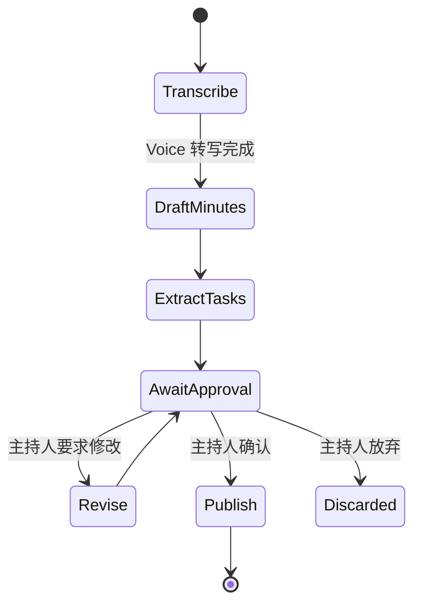

# Assistant 组件设计

> Starter Kit 四组件之一，也是四个里最复杂的。
> 前置：[`README.md`](README.md) · [`../../agent/architecture.md`](../../agent/architecture.md)
> 版本：v0.1 · 2026-09-05

## 1. 它到底是个什么东西

Documents 处理**一份文档**，Assistant 处理**一条流程**。

区别在于：Assistant 的每个场景都有**中间要人点头**的环节。这不是可选的产品特性，
而是这类场景的本质——把会议纪要变成任务、把客户消息变成回复，
**这些动作会代表组织对外产生后果**，所以默认必须有人确认。

**五个流程**：

| 流程 | 输入 | 中间产物 | 输出 | 谁点头 |
|:---|:---|:---|:---|:---|
| **会议 → 纪要 → 任务** | 录音/转写 | 纪要草稿 | 任务清单（负责人+截止） | 会议主持人 |
| **邮件/消息 → 草稿回复** | 收到的消息 | 意图+要点 | 回复草稿 | 处理人 |
| **文档 → 行动项** | 一份文档 | 提取的承诺/待办 | 任务清单 | 文档负责人 |
| **调研 → 结构化摘要** | 一个问题 + 资料 | 分主题笔记 | 结构化摘要 | 提问者 |
| **LINE 客户询问 → 建议回复** | LINE 消息 | 意图+检索到的业务信息 | 回复建议 | 客服 |

第五个是 LINE Agent 的**半自动版**，与完整的 LINE Agent 设计
（[`../line-agent-design.md`](../line-agent-design.md)）共用同一套状态机，
区别只在是否开放自动放行。

### 边界：它不是什么

- **不是任务管理系统。** 输出的任务清单交回客户现有工具（Trello/Notion/Excel/LINE）。
  我们不做又一个待办应用。
- **不是自动回复机器人。** 默认全部要人审，**自动放行是逐用例显式开启的白名单**。
- **不做跨流程编排。** 五个流程各自独立，不做「会议纪要自动触发邮件」这种链式。
  链式的失败排查成本远超它省的时间。

## 2. 开源基座

| 组件 | 版本 | License | 它负责哪一段 |
|:---|:---|:---|:---|
| **LangGraph** | `0.2+` | MIT | 有状态的流程图 + **中断点（人工审批）** + 状态持久化 |
| **iDoris Gateway** | 自建（LiteLLM 基座） | Apache 2.0 / MIT | 模型调用、路由、成本闸、审计 |
| **iDoris Voice** | faster-whisper | MIT | 会议流程的语音输入 |
| **iDoris Documents** | 本 Kit | — | 文档流程的解析与抽取 |
| **Postgres** | 16 | PostgreSQL License | LangGraph checkpointer + 审批队列 |

> **License 状态**：LangGraph MIT **[待核：确认 langgraph 与 langgraph-checkpoint
> 两个包的 LICENSE，以及是否强制依赖 LangSmith]** —— 这条很重要，
> 见 [`../oss-due-diligence.md`](../oss-due-diligence.md)。

### 为什么需要状态机（而不是一串函数调用）

因为**人要在中间点头**，而人可能：
- 十分钟后才看到通知
- 直接下班了，明天才处理
- 改了草稿的一半再放行
- 驳回并要求重做

一串函数调用没法在「等人」这里停住并**持久化**。LangGraph 的
`interrupt` + checkpointer 正好是为这个设计的：流程在中断点存盘退出，
人处理完再从断点恢复。

**这是选 LangGraph 而不是自己写的唯一理由**——如果没有人工审批，
五个流程用普通函数串起来就够了，不需要引入这个依赖。

## 3. 我们自己写什么

### 3.1 五个流程的图定义

以「会议 → 纪要 → 任务」为例：



`AwaitApproval` 是 LangGraph 的 `interrupt` 节点：状态存进 Postgres，
流程挂起，审批队列出现一条待办。

**五个流程的图结构高度相似**（生成 → 等审 → 发布/修改/放弃），
所以我们写的是**一个通用骨架 + 五份配置**，不是五套独立代码。

### 3.2 审批队列

这是我们自己写的、也是客户真正每天要用的东西：

```
GET  /approvals?assignee=me&status=pending
     → [{id, flow, summary, created_at, draft, sources}]
POST /approvals/{id}/approve   body: {edited_draft?}
POST /approvals/{id}/reject    body: {reason}
```

**三条设计规矩**：

1. **草稿可编辑后放行。** 人改一半再发是最常见的路径，
   强制「要么全接受要么全驳回」会让人干脆不用。
2. **必须显示来源。** 纪要里每条任务能点回转写稿的哪一段；
   回复草稿能看到检索到了哪条业务信息。没有出处的草稿没人敢发。
3. **超时不自动放行。** 超过 N 小时未处理就升级提醒，**绝不默认发出去**。
   这条与「默认全审」是同一个原则的两面。

### 3.3 自动放行白名单

自动放行**不是一个开关，是一张表**：

```jsonc
{
  "flow": "line_customer_reply",
  "auto_release_when": {
    "intent": ["business_hours", "location", "price_list"],  // 只有这几类意图
    "confidence": ">= 0.9",
    "no_pii_in_reply": true,
    "within_business_hours": true
  }
}
```

**默认这张表是空的。** 每加一条都必须：客户书面确认 + 已积累 ≥50 条
人工审批的历史数据证明这类意图的准确率 + 有随时关掉的开关。

理由写在 `../../agent/architecture.md` 的边界五：
**一条错误的自动回复对本地小生意的伤害，远大于省下的那点人工。**

## 4. 接口

```
POST /assistant/flows/{flow}/start   → {run_id}
GET  /assistant/runs/{run_id}        → {state, current_node, draft?, sources?}
     （审批走 §3.2 的 /approvals 接口）
```

与其他组件的关系：

```
Voice ──转写──┐
              ├──> Assistant（LangGraph 状态机）──> 审批队列 ──> 客户现有工具
Documents ────┘                    │
                                   └──> Gateway（模型调用 + 成本审计）
```

## 5. 最小可用形态

**先做「会议 → 纪要 → 任务」一条端到端**，其余四个排后面。

理由：

- **它是唯一一条能自己演示的**——不需要客户提供数据，
  拿一段我们自己的会议录音就能跑给人看。
- **它串起了三个组件**（Voice → Assistant → 审批），
  一条跑通等于验证了整个 Kit 的骨架。
- **它的价值最容易量化**：会议报告 60 分钟 → 10 分钟，
  这正是源文档 Before/After 表里的一行。
- 它的**失败代价最低**：纪要写错了，人在审批时会看到并改掉。

「LINE 客户询问」排最后——它对外产生后果，是五个里风险最高的。

## 6. 怎么演示给客户看

**5 分钟脚本**：

1. 当场录一段 2 分钟的对话（**用泰语或泰英混杂**，这是差异化）。
2. 跑流程，展示：转写 → 纪要草稿 → 抽出的三条任务（含负责人与截止）。
3. **在审批界面上改一条任务的负责人**，然后放行——
   展示「人可以改一半再发」，这比全自动更让客户放心。
4. 点开一条任务的来源，跳回转写稿的对应位置。
5. 说明：**默认所有输出都要人审，自动放行需要你书面同意才开。**

第 5 步是这个组件最强的卖点，不是最弱的。企业主怕的不是 AI 不够聪明，
是**AI 替他做了他不知道的决定**。

## 7. 风险

| 风险 | 影响 | 对策 |
|:---|:---|:---|
| 泰语会议转写质量不足 | 纪要不可用 | 演示前用真实场景预跑；Voice 组件的评测方法见 [`voice.md`](voice.md) |
| 审批队列没人看 | 流程卡死，客户觉得没用 | 超时升级提醒；上线时把队列接进客户已有的 LINE/邮件 |
| 客户要求全自动 | 事故风险 | 白名单机制 + 需书面确认 + ≥50 条历史数据 |
| LangGraph 上报 LangSmith | 数据外流 | **[已核 2026-09-05]** 不设变量时零出网（socket 层验证 + 正对照）；但设了 `LANGSMITH_TRACING` **会连** api.smith.langchain.com。**对策**：部署清单显式 unset + **启动时断言检测到就拒绝启动**（打警告没人看）+ 部署前跑 `tools/verify/langgraph-egress-probe.py` |
| 五个流程各自演化成独立代码 | 维护成本爆炸 | 通用骨架 + 配置，代码评审时守住 |
